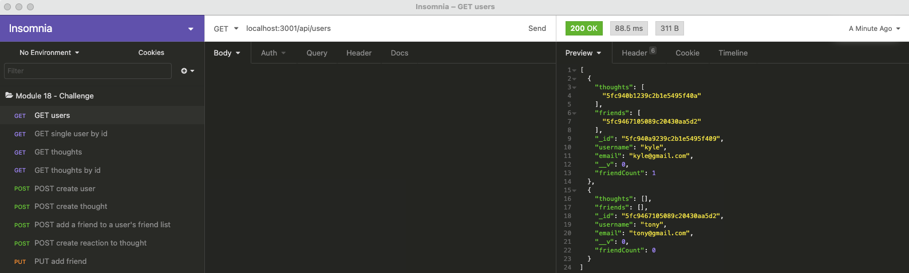

<h1 align="center"> social-network-api-mongoose-express-js-james</h1>

## Description

An API for a social network web application where users can share their thoughts, react to friends’ thoughts, and create a friend list.


  

## Video Demo





 
 
💾 


## User Story

```
AS A social media startup
I WANT an API for my social network that uses a NoSQL database
SO THAT my website can handle large amounts of unstructured data
```

## Acceptance Criteria

```
GIVEN a social network API
WHEN I enter the command to invoke the application
THEN my server is started and the Mongoose models are synced to the MongoDB database
WHEN I open API GET routes in Insomnia Core for users and thoughts
THEN the data for each of these routes is displayed in a formatted JSON
WHEN I test API POST, PUT, and DELETE routes in Insomnia Core
THEN I am able to successfully create, update, and delete users and thoughts in my database
WHEN I test API POST and DELETE routes in Insomnia Core
THEN I am able to successfully create and delete reactions to thoughts and add and remove friends to a user’s friend list
```
   
## Table of Contents
- [Description](#description)
- [User Story](#user-story)
- [Acceptance Criteria](#acceptance-criteria)
- [Table of Contents](#table-of-contents)
- [Installation](#installation)
- [Usage](#usage)
- [Testing](#testing)
- [Contributing](#contributing)
- [Questions](#questions)

## Installation
💾   
  
`npm init`

`npm install`
  
## Usage
💻   
  
`npm start`

With Nodemon:

`node server.js`

## Contributor
💻

 [James Chukwu](https://github.com/Okingiboy/social-network-api-mongoose-express-js-james)


## Questions
Questions about this repository? Please contact me at [okoriechukwu@yahoo.com](mailto:okoriechukwu@yahoo.com). View more of my work in GitHub at [okingiboy](https://github.com/okingiboy) 

